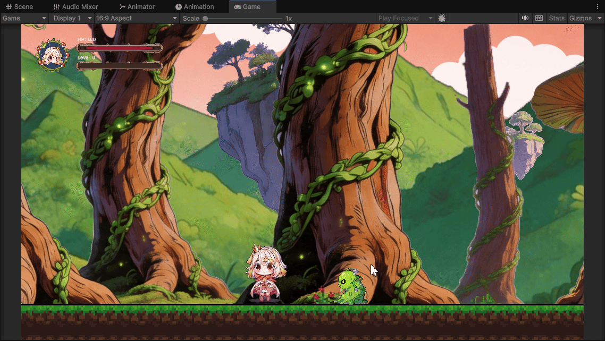
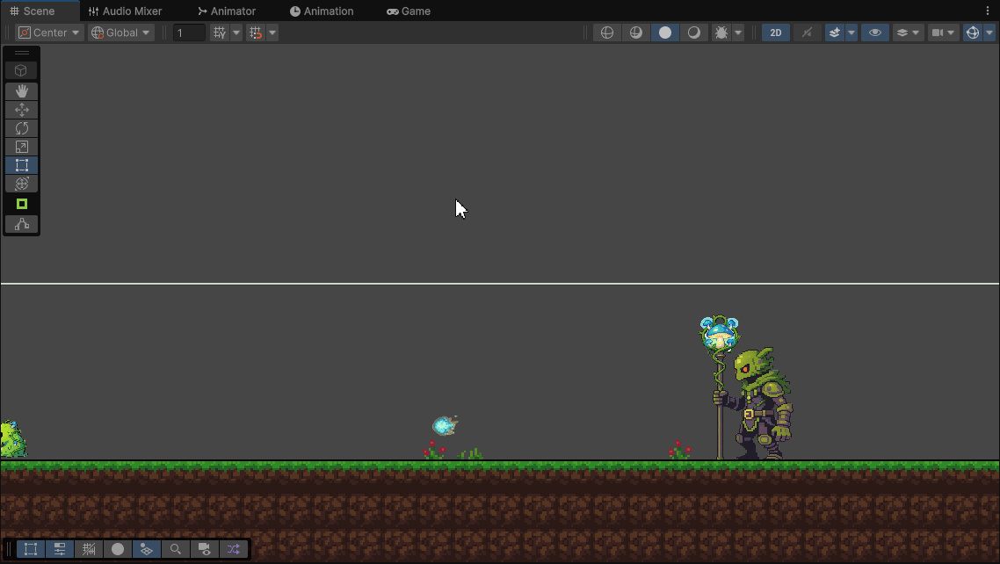
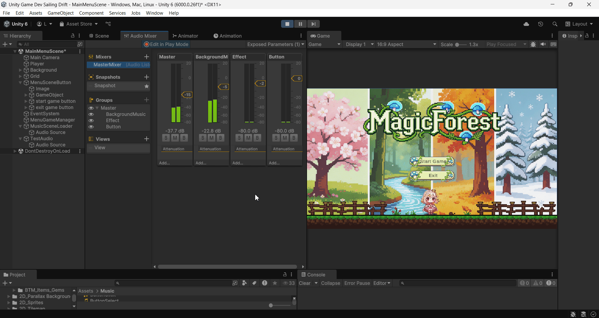

# 🌲✨ Magic Forest

## 🎮 Descripción del Proyecto

**Magic Forest** es un prototipo de videojuego 2D tipo *side-scroller* desarrollado en Unity.

El jugador controla a un personaje que explora un bosque mágico, lucha contra enemigos y gana experiencia para progresar a lo largo de diferentes escenas.

El objetivo principal del proyecto es aplicar los conceptos técnicos trabajados en clase en el desarrollo de un prototipo funcional.

---

## 👩‍💻 Autor

**XueMei Lin**

Una estudiante de Máster en Desarrollo de Videojuegos en la Universidad de La Laguna

**!!El autor tiene todo el derecho del juego!!**

---

## 📌 Estado del Proyecto

* Prototipo funcional (Primera versión completada)

---

## 🎯 Objetivos del Proyecto

En este prototipo se han implementado las siguientes mecánicas y sistemas requeridos:

* Movimiento del personaje
  * Mover izquierda y derecha
  * Salto
  * Ataque
* Sistema de animaciones
* Recolección de objetos usando la tecnica de pooling
* El uso de Sonido
* Scrolling y Parallax del fondo
* Uso de Tilemap con múltiples capas
* Sistema de UI
* Eventos de juego (colisiones, triggers, UI)
* Control de cámara con Cinemachine

---

## 🧩 Implementación Técnica

### ⭐ Sistema de Jugador y sistema de animaciones
* Uso de Animator Controller con estados:
  * Idle
  * WalkRight (utiliza flix para realizar walkLeft)
  * Attack
  * Death
* Transiciones entre estados
* Uso de **Animation Events** para sincronizar animación y lógica

---

### 👾 Sistema de Enemigos

* Implementación de diferentes tipos de enemigos
  * Enemigo básico (hace daño cuando colisiona)
  * Enemigo Boss (con ataque frecuentemente)
* Movimiento animaciones de desplazamiento

* Enemigo Básico
  
* Enemigo Boss
  

---

### ⭐ Parte del perfil

* Obtener experiencia cuando mata a un enemigo o recolectar objetos
* Perdida de vida cuando un enemigo causa daño al jugador

---

### 🎁 Object Pooling

* Implementado en la escena de recompensa
* Reutilización de objetos en lugar de instanciación/destrucción constante que ayuda a mejorar el rendimiento y la gestión de memoria

---

### 🌲 Sistema de Tilemap

Uso de Tilemap para la construcción del nivel con varias capas:

* Capa de suelo (colisiones)
  
* Capa de decoración
  
* Capa de elementos interactivos
  

Permite separar la lógica del juego de los elementos visuales.

---

### 🌄 Fondos (Parallax y Scrolling)

* Parallax en la escena principal para simular profundidad
  
  
* Scrolling en la escena de recompensa
  

---

### 🎮 Escenas implementadas

* Menú principal con sistema de inicio y salida del juego
  
* Escena principal (bosque en primavera) con exploración, combate y mecánicas principales
  
* Escena de recompensa con sistema de recolección y object pooling
  

---

### 🧠 Sistema de Eventos

* Eventos de recolección de objetos y obtención de experiencia  
* Eventos de UI:
  * Mostrar la llave en el HUD al recogerla  
  * Actualización de la barra de vida  
  * Actualización de la barra de experiencia  
  * Interacción con botones  
  * Activación de paneles (fin de nivel, información, etc.)  
* Eventos de juego:
  * Apertura de puertas condicionada cuando el jugador tenga la llave  
  * El cambio de escena mediante triggers  
  
---

### 🎥 Cámara (El uso de Cinemachine)
* Uso de Cinemachine Virtual Camera
  
  * Seguimiento del jugador
  * Control del borde
  

---

### 🔊 Sistema de Audio

* Uso de AudioMixer para:

  * Música de fondo
  * Efectos de sonido
  * Control general del audio
  

---

## 🛠️ Tecnologías Utilizadas

* Unity
* C#

---

## 🚀 Desarrollo Futuro

### Funcionalidades pendientes

* [ ] Sistema de cartas (selección de mejoras al subir nivel)
* [ ] Sistema de estadísticas (vida, ataque, defensa)(al final del juego)
* [ ] Más tipos de enemigos y comportamientos
* [ ] Nuevas escenas (verano, otoño, invierno)
* [ ] Mejora de la UI, añadir configuraciones u mejora de los UI existentes
* [ ] Más animaciones del jugador o enemigos
* [ ] Diseñar más personajes que puede el usuario puede selecionar 
* [ ] Diseñar más tipos de arma

---

## 🎮 Algunos Gameplay

(Si no muestran los gifs, es porque están cargano)

